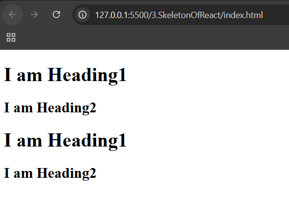

# ⚛️ React Chapter 3: Creating Complex Structure

> In the last chapter, we saw how to print a simple "Hello World" using the React Brain 🧠. But real-world websites aren't just one line of text; they are deep, nested forests of HTML! 🌳 Today, we'll see how to build complex structures and why doing it manually is a bit of a nightmare. 😱

---

## 🌿 1. Building a "Nested Forest" (Complex Structure)

Remember our friend `React.createElement(type, props, children)`? To create complex UIs, we use the 3rd argument (Children) to nest elements inside each other like Russian Dolls. 🪆

- **Arguments**: `createElement(type, props, children)`
  1. **Type** — The first argument defines the type of element (e.g., `"div"`, `"h1"`).
  2. **Props** — The second argument is for "props" (properties) like `id` or custom attributes (e.g., `xyz: "abc"`).
  3. **Children** — The third argument defines what is inside the element. This can be:
     1. 📝 **A String** — for text in an HTML element.
     2. 🧩 **Another React Element** — to create a Parent → Child relationship.
     3. 📦 **An Array of Elements** — to create Siblings (elements living side-by-side).

- **Complex Nesting** — To create deep structures, we nest `React.createElement` calls inside arrays.

### 🛠️ The "Parent-Child-Sibling" Example

Imagine we want to build this structure in HTML:

```html
<!-- Creating Complex Structure -->
<div id="parent">
  <div id="child1">
    <h1>I Am Heading1</h1>
    <h2>I Am Heading2</h2>
  </div>
  <div id="child2">
    <h1>I Am Heading1</h1>
    <h2>I Am Heading2</h2>
  </div>
</div>
```

```js
/**
 * To create this structure:
 * --> child1 and child2 should be an array in parent to be siblings
 * --> h1 and h2 headings should be inside child1 and child2 as an array to be siblings
 *
 * Pseudo code: represents only 3rd arg of createElement function
 * parent([ child1([h1("text"), h2("text")]), child2([h1("text"), h2("text")]) ])
 */

const parent = React.createElement("div", { id: "parent" }, [
  React.createElement("div", { id: "child1" }, [
    React.createElement("h1", {}, "I am Heading1"),
    React.createElement("h2", {}, "I am Heading2"),
  ]),
  React.createElement("div", { id: "child2" }, [
    React.createElement("h1", {}, "I am Heading1"),
    React.createElement("h2", {}, "I am Heading2"),
  ]),
]);
```

> 🪆 Using an array is like saying: **"Here is a list of things to put inside this box!"**

---

## 📺 2. Rendering the Blueprint to Reality

- 🗺️ **The Virtual DOM Object** — `parent` is still just a massive, nested JavaScript object. It is a lightweight "blueprint".
- 🎯 **Initialization** — `ReactDOM.createRoot` finds the `#root` "border" in your real HTML.
- ⚡ **The Conversion** — When you call `root.render(parent)`, React takes that giant JS object and converts it into a real C++ DOM structure in one go.
- 🔄 **The Replacement** — When React renders, it **replaces** everything already inside your `<div id="root">`. It doesn't append; it **takes over!**



---

## ⚠️ The "Manual Pain" Realization

Take a look at that `parent` code again. Imagine building a full website like Amazon or Netflix using only `React.createElement`. 🤯

| Problem            | Description                                                                         |
| ------------------ | ----------------------------------------------------------------------------------- |
| 😵 **Readability** | It becomes a "Bracket Hell." You'll get lost in `([([([])])])`.                     |
| 🔧 **Maintenance** | Changing one `div` to a `section` requires searching through a mountain of JS code. |
| 📈 **Scalability** | It's messy, hard to optimize, and definitely not "developer-friendly".              |

> 🔩 **The Truth:** We are currently using React in its "raw" form. It's powerful, but it's like building a car by hand-forging every single screw.

---

## 🚀 3. Intro to our Hero: Parcel 📦

We can't keep increasing complexity manually. We need a professional setup. In the next chapter, we will introduce a tool called **Parcel**.

### 📌 What is Parcel?

Parcel is a **Build Tool (Bundler)**. Think of it as a personal assistant for your project that:

- ✅ Auto-manages your project structure.
- ✅ Bundles all your messy files into one clean package.
- ✅ Optimizes your code so it runs lightning-fast.
- ✅ Handles Dependencies (so we don't have to use those long CDN links forever!).

👉 Parcel reduces complexity and helps maintain clean architecture.

---

> 💡 **Up next:** We are going to stop being "manual laborers" and start using professional tools. Get ready to meet Parcel — the engine that will truly ignite our React journey! 🚀🔥
