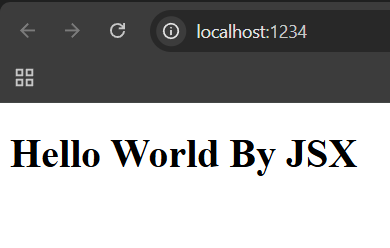
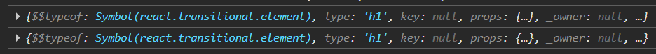
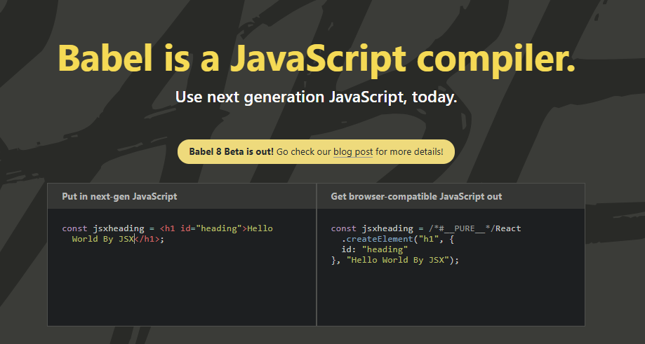

# ⚛️ React Chapter 5: JSX Made Life Easy 🚀

> In the previous chapters, we felt the "pain" of building complex, nested structures manually using `React.createElement`. 😫 It was messy, hard to read, and even harder to maintain. In this chapter, we explore how JSX revolutionized the way we build UIs, making our code readable, maintainable, and developer-friendly.

---

## 🛠️ 1. Making Professional Scripts

Before we dive into the code, let's optimize how we run our project. Instead of typing long commands in the terminal every time, we define shorthand scripts in our `package.json` file.

### 📌 Updating `package.json`

```json
"scripts": {
    "start": "parcel src/index.html",
    "build": "parcel build src/index.html",
    "test": "jest"
}
```

### 📌 How to Run Them?

From now on, we will use these shorthand commands:

- 🟢 **To start the project:** Run `npm start` (or `npm run start`). This triggers the Parcel development server.
- 📦 **To build the project:** Run `npm run build`. This creates a production-ready bundle.

> ⚠️ **Note:** While `npm start` works directly for the `start` script, for most other scripts (like `build`), you must use the `run` keyword.

---

## 🤯 2. The Problem with Complexity

As we saw in previous chapters, creating elements using `React.createElement` is hard to maintain and is not developer-friendly.

Imagine building a real-world application with:

- 20+ nested HTML elements.
- Dozens of CSS classes and attributes.
- Dynamic logic mixed with UI.

Doing this manually with `createElement` leads to a **"Nesting Hell"** of brackets and commas that is impossible to read and a nightmare to debug.

### 📌 The Origin of JSX

To solve this, the team at Facebook (now Meta) introduced **JSX in 2013** alongside React. The goal was simple:

- 🔗 Combine UI structure + Logic in one place.
- 👁️ Make the code look like the final output (HTML).
- 🚀 Drastically improve the developer experience.

---

## ⚛️ 3. What is JSX?

**JSX (JavaScript XML)** is a syntax extension for JavaScript. It allows us to write HTML-like code directly inside our JavaScript files.

### 📌 Myths vs. Reality

|                |                                                                                |
| -------------- | ------------------------------------------------------------------------------ |
| ❌ **Myth**    | JSX is just HTML inside JS.                                                    |
| ✅ **Reality** | JSX is an HTML-like or XML-like syntax that gets **compiled** into JavaScript. |

### 📌 Creating JSX

In your `app.js`, you can now write:

```jsx
const jsxHelloWorld = <h1 id="heading">Hello World By JSX</h1>;
```

This looks like HTML, but it's assigned to a JavaScript variable. But wait — is this valid JavaScript? Let's try to render it, assuming it is the same as `reactElementHelloWorld` created with `createElement`:

```js
root.render(jsxHelloWorld);
```



Yes it worked! The code is way more readable and easy to define. Amazing. But **HOW** does the browser understand this?

---

## 🧙 4. The Magic Behind JSX (Babel)

### 📌 So, How Does it Run? Is JSX Valid JavaScript?

JSX is **not** JavaScript. JavaScript does not come with JSX inside it from core — the JavaScript engine in your browser (like V8) does not understand JSX. The JavaScript engine only understands standards defined in **ECMAScript**.

For example, when we print this in the browser console:

```js
const jsxHelloWorld = <h1 id="heading">Hello World By Aryan</h1>;
```

It will be a **Syntax Error**. The browser doesn't even know what this is. Then how does the rendering happen without an error? So who is behind those things?

### 🔮 The Secret Engine: Babel

Parcel uses a tool called **Babel** behind the scenes.

- Babel is a **JavaScript Compiler/Transpiler**.
- It takes your beautiful JSX code and "transpiles" (converts) it into `React.createElement` calls that the browser can understand.

### 📌 The Proof (Console Log Comparison)

If we log both versions in `app.js`:

```jsx
const reactElementHelloWorld = React.createElement(
  "h1",
  { id: "heading" },
  "Hello World",
);
const jsxHelloWorld = <h1 id="heading">Hello World By JSX</h1>;

console.log(reactElementHelloWorld);
console.log(jsxHelloWorld);
```

**Output:**



Both are the **exact same things** — just a difference of readability and complexity. In the end, JSX is transpiled into `createElement` and as we discussed in Chapter 2, it's just a **JavaScript Object**. This proves that JSX is just **"syntactic sugar"** for `React.createElement`.

> 🔬 You can visit [babeljs.io](https://babeljs.io/) and paste your JSX to check what code is internally converted. You will see it transform into `React.createElement` in real-time! It takes next-gen JS and gives you browser-compatible JS.



Babel does many things as well — you can explore it from the official website.

---

## 🚀 5. Power Features of JSX

### 📌 1. Multi-line JSX

To keep your code clean when writing multiple lines of JSX, you must wrap the code in **parentheses `( )`**. This helps JavaScript understand where the block starts and ends.

```jsx
const multilineJSX = (
  <div id="parent">
    <div id="child1">
      <h1>I Am Heading 1</h1>
      <h2>I Am Heading 2</h2>
    </div>
    <div id="child2">
      <h1>I Am Heading 1</h1>
      <h2>I Am Heading 2</h2>
    </div>
  </div>
);
```

### 📌 2. JavaScript Inside JSX (The Curly Braces)

This is the **"Superpower"** of JSX. You can execute any JavaScript expression (math, variables, function calls) directly inside your UI using **curly braces `{ }`**.

```jsx
const number = 3000;
const text = (
  <div>
    <h1>Here we can also add any JavaScript using curly braces:</h1>
    {console.log("Hello! I am running inside JSX")}
    <p>Sum of 100 + 200 is: {100 + 200}</p>
    <h2>{"JSX is Amazing!"}</h2>
    <h2>{number}</h2>
  </div>
);
```

### 📌 3. Attribute Differences

Because JSX is technically JavaScript, we cannot use reserved JS keywords as attributes. Instead we use those.

| HTML Attribute | JSX Equivalent |
| -------------- | -------------- |
| `class`        | `className`    |
| `tabindex`     | `tabIndex`     |
| `for`          | `htmlFor`      |

> 📐 **Rule of Thumb:** All attributes in JSX follow **camelCase** naming conventions.

---

## ✅ Summary

- 🧩 JSX is **NOT** HTML, but it looks like it to make our lives easier.
- 🔮 **Babel** (managed by Parcel) is the secret engine that converts JSX into `React.createElement`.
- 📦 Everything in React eventually becomes a **JavaScript Object** before it hits the DOM.

> 🏁 **From now on, we will leave `createElement` behind and use JSX for everything!** 🚀

---

> 💡 **Up next:** Now that we have mastered JSX, we will explore **Components** — the building blocks of React — and understand why they are the heart of every React application!
