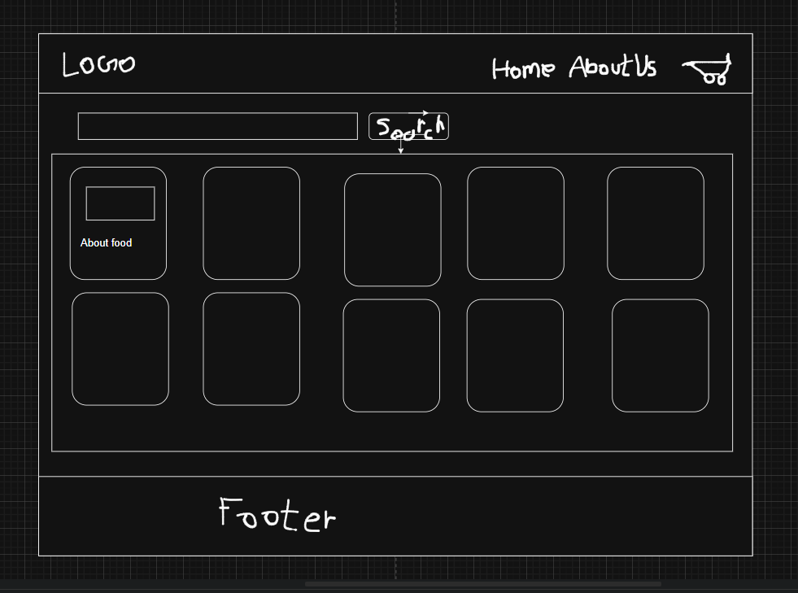

# ⚛️ React Chapter 7: Building a Real-World UI

> In this chapter, we move from theoretical components to building a functional **Basic Food Delivery Application UI**. We will explore the different ways to pass data (Props) and how to handle lists effectively.

---

## 🏗️ 1. App Architecture (Planning)

Before writing any code, professional developers plan the hierarchy. Based on our UI design, here is our component map:

```md
AppLayout (Root container)
├── Header (Logo & Navigation)
├── Body (The main content area)
│   ├── Search Bar
│   └── Restaurant Container
│       └── RestaurantCard (The reusable template)
└── Footer (Links & Copyright)
```



---

## 🎁 2. Deep Dive into Props (Properties)

Props are used to pass data from a **Parent** component to a **Child** component. There are several ways to implement this:

### 📌 Possibility 1: Manual / Static Passing

When you have a few specific items and want to pass data manually like HTML attributes.

**In Parent (`Body`):**

```jsx
{
  /* This data is converted into a 'props' object automatically */
}
<ResCard
  name="Meghana Foods"
  cuisine="Biryani, North Indian, Asian"
  rating="4.4"
  time="38"
/>;
```

**In Child (`ResCard`):**

You can receive it like a standard object:

```jsx
const ResCard = (props) => {
  return (
    <div className="res-card">
      <h3>{props.name}</h3>
      <p>{props.cuisine}</p>
    </div>
  );
};
```

### 📌 Possibility 2: Destructuring (Cleaner Code)

Instead of writing `props.name` every time, we can "extract" the variables immediately.

- **Method A: Destructuring in the body**

```jsx
const ResCard = (props) => {
  const { name, cuisine, rating } = props; // Extracting values
  return <h3>{name}</h3>;
};
```

- **Method B: Destructuring in the parameters ✅ (Highly Recommended)**

```jsx
const ResCard = ({ name, cuisine, rating }) => {
  return <h3>{name}</h3>;
};
```

### 📌 Possibility 3: Dynamic Passing with Destructuring ✅ (Best & Highly Recommended)

**In Parent (`Body`)** — pass an object of data in props:

```jsx
<ResCard resData={restaurantObject} />
```

**In Child (`ResCard`):**

1. Simple way — but not the cleanest:

   ```jsx
   const ResCard = (props) => {
     return <h1>{props.resData.info.name}</h1>;
   };
   ```

2. ✅ Cleaner and Highly Recommended:

   ```jsx
   const ResCard = (props) => {
     const { resData } = props;
     const { name, cuisines } = resData?.info; // Cleaner!

     return (
       <div>
         <h1>{name}</h1>
         <div>{cuisines}</div>
       </div>
     );
   };
   ```

---

## 🔄 3. Rendering Lists (The Manual vs. Pro Way)

In a real app like Swiggy, there might be 1,000 restaurants. How do we display them?

### ❌ The Manual Way (Not Scalable)

You could call the component multiple times manually, but this is a nightmare to maintain:

```jsx
<div className="res-container">
  <ResCard resData={realTimeRestarantData[0]} />
  <ResCard resData={realTimeRestarantData[1]} />
  <ResCard resData={realTimeRestarantData[2]} />
  <ResCard resData={realTimeRestarantData[3]} />
  {/* Imagine doing this for 100 restaurants! */}
</div>
```

### ✅ The Professional Way (Using `.map()`)

We use the JavaScript `.map()` function to loop through our data array and generate cards automatically. This is clean, short, and handles any amount of data.

```jsx
<div className="res-container">
  {realTimeRestarantData.map((restaurant) => (
    <ResCard key={restaurant.info.id} resData={restaurant} />
  ))}
</div>
```

---

## 🔑 4. The `key` Prop (Why is it Mandatory?)

When we use `.map()` or loop any list, React requires a `key`.

- 🧠 **Why?** — If a new restaurant is added to the list, React uses the `key` to identify exactly which item is new. Without a key, React has to re-render the entire list, making the app slow. With a key, React knows which object is new and renders only that.
- ✅ **Best Practice** — Always use a **Unique ID** from your data (like `id: "37687"`).
- ⚠️ **Avoid** — Using `index` as a key. If the list order changes, using index can cause bugs in your UI.

---

## ⚙️ 5. Config Driven UI

Modern UIs are **"Config Driven."** This means the Backend (API) sends a **"Config"** (data object) that tells the Frontend what to show.

- 🌆 **Example** — If you are in Delhi, the API sends Delhi restaurants. If you are in Mumbai, it sends Mumbai data.
- 🔁 The **Code** remains the same, but the **UI** changes based on the data.

---

## 🎨 6. Styling in React

### 📌 Inline Styles

In React, inline styles are not strings — they are **JavaScript Objects**.

```jsx
const cardStyle = {
  backgroundColor: "#f0f0f0",
};

<div style={cardStyle}></div>

// OR directly
<div style={{ backgroundColor: "#f0f0f0" }}></div>
```

> 📐 **Note:** We use `camelCase` (`backgroundColor`) instead of kebab-case (`background-color`).

---

## ✅ Summary

| Concept                 | Description                                       |
| ----------------------- | ------------------------------------------------- |
| 🎁 **Props**            | Pass data from Parent to Child.                   |
| 🧹 **Destructuring**    | Makes your code readable and clean.               |
| 🔄 **`.map()`**         | The best way to render lists dynamically.         |
| 🔑 **Keys**             | Crucial for React performance and tracking items. |
| ⚙️ **Config Driven UI** | Architecture where data controls the interface.   |

---

> 💡 **Up next:** We will set up the same folder structure as a real React app and explore **Hooks**!
