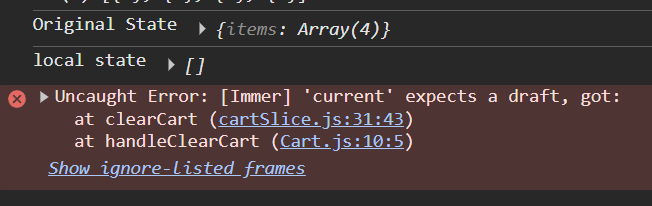

part-1
first redux s not requre to build application its not madotory thing 
when the application grows huge and data mangement is being complex then using redux make sense
so use it only when required

--> redux is diff then react both are seperate library 
so use it wisely 
and redux is not only library to mange state zustand is aslo other lib a light weight lib 

--Redux 
redux is used to manage state and another adv of redux is it offer easy debugging . there is chrome exttension for it 

part-2
redux is heavily used with react it aslo works with many frame work
there are 2 lib it offer react-redux and redux-toolkit
1react-redux acts bridge bet react and redux
redux toolkit is newer way of writing redux which has simplified a lot 
so we will learn redux toolkit with react-redux we won't go for vanilla redux 
visit redux 

part-3
so we will buid cart system in our app by clicking ad we willadd item in our cart
we make cart page and to store this all cart info we will use erdux store
so let see the architexture of RTK  
note book and pen

part-4
now lets implement code for RTK
# redux  Tookit
install redux toolkit and react-redux
```cmd
npm i @reduxjs/toolkit react-redux
```
-Build our store 
---Appstore in utils 
-connect our store to our app (bridge)
--create cart slice
-dispatch an action
-selector 


part-5
be very careful when subscribing to the store 
we should only subscribe to the specific part/slice to hthe store otherwise a big perfomance loss will be there
```js
 const store = useSelector((store) => store);
 const cartItems = store.cart.items;
//here it will always subscribe to the whole store not the specific part of the store
``` 
this is same as
```js
 const store = useSelector((store) => store.cart.items);
``` 
but we always subcribing the whoe store because even when diff slice is updated we have nothing to do with dff slice 
the name is selector use to select specific item not whole store

as the application grows then it will be a big perfomance loss

part-6

now in the app store it is reducer
```jsx
const appStore = configureStore({
    reducer : {
        cart : cartReducer,
    }
});
```
and in the cart slice it is reducres and there we are exporting reducer a single one
```jsx
const cartSlice = createSlice({
    name : "cart",
    initialState : {items : []},
    reducers : {
        addItem : (state , action)=>{state.items.push(action.payload)},
        removeItem : (state)=>{state.items.pop()},    
        clearCart : (state)=>{state.items.length = 0;}
    }
})

//
export const {addItem , removeItem , clearCart} = cartSlice.actions

//exporting single reducer 
export default cartSlice.reducer;
```
part-7
eariler dev of vanill redux use to shout on there website that don't mutate the state 
```jsx
const cartSlice = createSlice({
    name : "cart",
    initialState : {items : []},
    reducers : {

        addItem : (state , action)=>{

            //-->Vanilla(older) DON'T MUTATE STATE
            const newState =  [...state]
            newState.items.push(action.payload)
            return newState //returning was mandatory

            //But now we are just mutating it 
            state.items.push(action.payload)
            //no return req
            },

        removeItem : (state)=>{state.items.pop()},    
        clearCart : (state)=>{state.items.length = 0;}
    }
})

```
and somanydeveloper just modify the state diretly so many people make mistaking this thing so in new redux toolkit
we have to mutate the state
this is waht new api has

but actually behind the scene redux isacuall making state imuutable does he same thing vanilla does hehehe
it uses lib immer to do this
 it like finding the diff between original state ,mutated state and then give new state which is immutable


---
```jsx
clearCart : (state)=>{
            state = []
           // state.items.length = 0;
        }
```
also this thing will not work as this is not we muatating the state this is just we passing ref to the state variable
// state.items.length = 0; we can only mutate using this only
`state` is the local variable  this will have a value of original state so we have actually modify it 
if we do like state = [ ] then it just deinfe locally  (a new local varibale ) our function as para(stet,action) so we have to modify this state 
for eg

```jsx
//originalState = ["pizza" , "burger"]
clearCart : (state )=>{
    console.log(state) // ["pizza" , "burger"]
    state = []
    console.log(state) //[] this just make the local var empy not the original

    //but the originalState is still = ["pizza" , "burger"]
            
},
```

for example
```jsx
clearCart: (state) => {
      console.log("Original State", current(state));
      state = [];
      console.log("local state", state);
      console.log("Original State", current(state));
        //state.items.length = 0;
},
```

so on 3rd console it expects a different object but it got something else so this is want 

---
actually RTK says that either we haveto mutate a state or return a new state
```jsx
clearCart: (state) => {
    return {items : []  }
},
```
so this also works and this will be now our original state


part - 8
redux dev tool
--redux toolkit rtk query

at first we use in redux uwe se things middleware and thungs but now rtk query